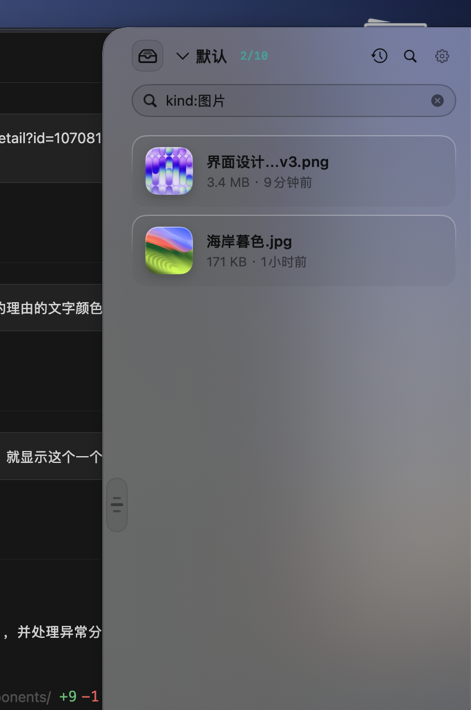
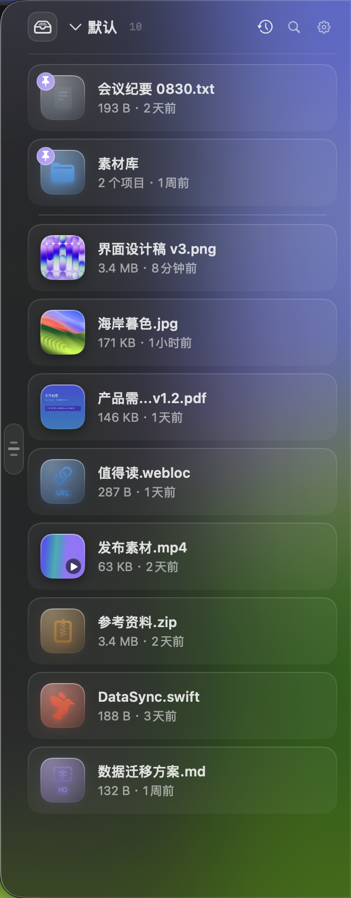

# FileDrawer · A File Drawer for macOS

[](https://github.com/kingsxiao/mac-file-drawer/actions/workflows/ci.yml)
[](https://github.com/kingsxiao/mac-file-drawer/releases)
[](LICENSE)


**English** | [简体中文](README.zh-CN.md)

FileDrawer is a minimal macOS utility: a translucent **drawer** that slides out from the edge of your screen. Stash files & folders at hand while you work, drag them out when you need them — like Yoink or Dropover, but **native, free, and open source**.

Built with **Swift + AppKit (NSPanel) + SwiftUI**, zero third-party dependencies.

## Screenshots

<table>
  <tr>
    <td align="center">
      <br>
      <sub>Search <code>kind:image</code>: type-syntax filtering<br>＋ celadon <code>2/10</code> match counter</sub>
    </td>
    <td align="center">
      <br>
      <sub>Dark appearance: glass & brand color<br>brightened for readability</sub>
    </td>
    <td align="center">
      <br>
      <sub>Collapse into an edge chip:<br>latest thumbnail ＋ count ＋ pulse dot</sub>
    </td>
  </tr>
</table>

## Install

Download the DMG from [**Releases**](https://github.com/kingsxiao/mac-file-drawer/releases)
(universal binary, Apple Silicon / Intel; `SHA256SUMS.txt` included), mount it and
**drag FileDrawer into Applications**. The app is currently **ad-hoc signed**: the
first launch is blocked by Gatekeeper — **right-click → Open** to allow it
(see [Distribution & notarization readiness](#distribution--notarization-readiness)).

Prefer building from source: `git clone`, then `make install` (one-shot build & install)
or `make dmg` to roll your own DMG — see [Contributing](CONTRIBUTING.md).

## Features

- 🗂 **Drag in to stash**: drop files & folders from Finder (or any app) into the drawer; multi-select drops supported.
- 🗃 **Multiple drawer groups**: click the group name in the header to switch / create / rename / delete groups
  (each with a count badge); drops, pastes and ⌘V all land in the **current group**; right-click
  "Move to group" relocates items (whole multi-selection batches included); **⌘1–⌘9 jump between groups**;
  **each group remembers its own sort order** (the "default sort" setting only applies to groups without one);
  "Clear" and "Export" are group-scoped; data from older versions migrates into the "Default" group.
- ✍️ **Text & links too**: drag a text selection or a link from any app into the drawer and it materializes
  into a real file in an inbox folder (text → `.txt`, link → `.webloc`); drag out, preview and double-click
  behave exactly like regular files; underlying files are reclaimed after the item is removed and the undo
  window closes. **⌘V paste** works the same, with rich text (RTF from Word / browsers) auto-flattened to plain text.
- 🖼 **Images & promised files**: drag an image straight out of a web page and the **actual image file**
  lands in the drawer (not a `.webloc` link — image data wins over the accompanying URL); photos & videos
  dragged from Photos.app and attachments from Mail arrive as **file promises** and are received into the
  inbox folder with their original names; other media types (audio / PDF) drop in the same way.
  **⌘V** pastes a copied image ("Copy Image" in browsers / Preview) as a `.tiff`/`.png` file.
- ✋ **Drag out to retrieve**: drag an item out of the drawer — dropping on Finder copies the real file;
  mail clients, chat windows and everything else accept it too.
- 🖱 **Multi-select batches**: **⌘-click** to toggle items, **⇧-click** for ranges, **⌘A** to select all;
  Delete / ⌘C / ⏎ / context menus act on the whole batch Finder-style, batch removals are undoable;
  **drag a tile while multiple items are selected to drag them all out at once** (×N badge preview,
  dropped as a multi-file copy).
- 📌 **Pin & manual ordering**: right-click "Pin" keeps frequent items on top (brand-color pin badge) and
  **exempts them from expiry cleanup and capacity eviction**; "Rearrange → Move up / down / to front / to back"
  switches the group to manual ordering (⌘↑ / ⌘↓ nudge the selection).
- ✏️ **Rename**: right-click "Rename…" renames in place (name collisions get a numeric suffix, type is
  re-detected from the new extension).
- 🩺 **Stale-item detection**: background existence scans on launch / expand / list changes; stale items dim
  with a red "file no longer exists" hint and opening is blocked; one-click cleanup in Settings.
- 📂 **Open With**: right-click "Open With" submenu lists every app that can open the file (default app first).
- 🍃 **Menu-bar quick access**: tray menu includes "Recent items" (latest 6, click to open),
  "Export all to folder…" (batch copy, collision suffixes, stale skipped) and
  "Open inbox folder" (where dragged text/links/images materialize — searchable in Finder/Spotlight).
- 📋 **Clipboard interop**: **⌘C** puts selected items on the clipboard Finder-style (paste anywhere,
  multi-select copies multiple files); **⌘V** pulls files from the clipboard into the drawer, and
  text/link/image clipboards materialize into items; context menu offers "Copy file".
- ↩️ **Undoable removals**: after remove / clear / stale-cleanup, a toast at the bottom offers "Put Back"
  to restore items at their original positions, auto-dismissing on timeout; policy-based cleanups stay
  silent; duplicate drops get a "skipped N duplicates" hint.
- 👁 **Quick Look**: select an item and press **Space** for a native QuickLook card inside the drawer —
  videos play, PDFs paginate, images zoom; **↑↓ / ←→** switch live, **⏎** opens, **Esc** closes.
- 🔍 **Search & sort**: click the magnifier or **⌘F** for the search pill (click again / Esc to dismiss),
  as-you-type filtering with hit highlighting and a celadon `matched/total` counter next to the group name;
  multiple keywords intersect; **`kind:image` type syntax** (`kind:video`, `kind:code`, `kind:pdf`, …,
  English and Chinese aliases, multiple kinds union); when the name doesn't match, **Spotlight content
  search** supplements results (labeled "content match", can be disabled); sort by newest / oldest /
  name A–Z / type / manual, remembered per group, sort-button icon reflects the current mode.
- 🚪 **Collapse to a floating chip**: pull the handle to shrink the drawer into a glass **chip** hugging the
  screen edge (latest thumbnail ＋ monospace count ＋ brand-color pulse dot); click to expand; dropping
  files onto the chip auto-expands to catch them. Also toggleable from the menu bar.
- ⚡️ **Slide-in on launch**: the drawer slides out from the right edge at startup (non-activating panel —
  never steals focus).
- ⚡ **Thumbnail disk cache**: image / video / PDF thumbnails are cached on disk keyed by
  "path + mtime + size" fingerprints, so restarts don't re-decode (video frame extraction benefits most);
  replaced files invalidate automatically.
- 🔒 **Stays out of your way**: floats above normal windows and shows on every space, yet clicking it never
  activates away from your frontmost app.
- 👆 **Quick actions**: double-click opens a file (single-click mode available in Settings); hover reveals
  "Reveal in Finder / Save As… / Remove"; the context menu has "Copy file", "Copy path",
  "Move to folder…", "Rename…", "Open With" and everything else; file import lives in the menu bar / main menu (⌘O).
- ⌫ **Keyboard removal**: Delete removes the selection (whole batch when multiple are selected).
- 💾 **State restoration**: the item list (pins & manual order included) and sort preferences persist to
  UserDefaults and come back on restart (entries whose source file is gone are cleaned up).
- 🧹 **Shelf maintenance**: configurable expiry cleanup (1/7/30 days) and capacity caps (20/50/100 items,
  evicting oldest first, pinned exempt) — **per-group overrides supported** (Settings → General → group
  capacity; groups without one follow the global value); changes apply to existing items immediately and
  converge at launch; stale items can be purged in one click.
- 🍃 **Menu-bar icon**: tray menu with show/hide drawer, import, export all, recent items, clear, settings,
  about, quit.
- 🚀 **Launch at login & Dock toggle**: one-click "launch at login" (SMAppService, synced live with System
  Settings login items); the Dock icon can be hidden for a menu-bar-only existence, restored anytime.
- ⚙️ **Settings**: gear icon, menu bar → "Settings…", or **⌘,** — four tabs, all live:
  - **General**: expand/collapsed at launch, launch at login, purge missing files at startup, default sort,
    single-click open, auto-clean expired items, capacity cap, current item count & one-click cleanup;
  - **Appearance**: light/dark/auto, drawer width (280–420pt), screen-height ratio, vertical dock position,
    dock edge (left/right), dock to mouse's screen on expand (multi-display), material density
    (ultra-thin/thick/…), compact list, show size/time/thumbnails;
  - **Behavior**: auto-expand when dragging onto the collapsed chip, auto-collapse after dragging a file out
    or clearing, auto-collapse when switching apps, panel level (floating/normal), Dock icon toggle;
  - **Shortcuts**: global hotkey (Carbon RegisterEventHotKey) to expand/collapse from any app, default
    ⌥Space, click the key box to record a new combo (must include ⌘/⌥/⌃).

## Keyboard reference

| Key | Action |
| --- | --- |
| Click item | Select (and give the drawer keyboard focus; single-click-to-open optional) |
| ⌘-click / ⇧-click | Multi-select: toggle item / select range |
| ⌘A | Select all visible items |
| Space | Toggle Quick Look for the selection |
| ↑ ↓ | Move selection up / down (works while previewing) |
| ← → | Switch items while previewing (same as ↑↓) |
| PageUp / PageDown | Page the selection (8 rows) |
| Home / End | Jump to first / last item |
| ⌘↑ / ⌘↓ | Nudge selection in manual-order mode (auto-switches to it) |
| ⌘1 … ⌘9 | Switch to group N |
| ⏎ | Open selected file(s) (all of them on multi-select) |
| ⌘↵ | While previewing: open current item with default app and close preview |
| ⌘C | Copy selected item files (Finder-style, multiple on multi-select) |
| ⌘V | Put clipboard files / text / links into the drawer |
| Delete / ⌘⌫ | Remove selection (whole batch; toast offers "Put Back"); while previewing, remove current and auto-advance |
| Esc | Close preview / deselect / clear search |
| ⌘F | Focus search (supports `kind:image` type syntax) |

> Keyboard handling only engages while the drawer holds focus (click any item); keystrokes pass through
> untouched while typing in the search field.

## Automation: URL scheme & Shortcuts

Every core operation is scriptable — from shell, terminal, Shortcuts and Siri. Installing the .app registers
the `filedrawer://` scheme; the Shortcuts app gets matching actions (App Intents). Both paths share
`DrawerCommands`, so behavior is always identical.

### URL actions (11)

| Action | Parameters | Description |
| --- | --- | --- |
| `add` | `path=` (repeatable), `group=` (optional) | Add to drawer / group (created & switched to if missing), expands drawer |
| `reveal` | `path=` | Reveal file in Finder |
| `remove` | `group=`, `limit=` (0 = all) | Remove newest N items, undoable in-drawer |
| `clear` | `group=` | Clear group, undoable in-drawer |
| `pin` / `unpin` | `group=`, `limit=` (0 = all) | Pin / unpin newest N items (exempt from auto-cleanup) |
| `send-to-front` | `group=`, `limit=` (0 = all) | Move newest N to front, switches to manual order |
| `move` | `group=` (source), `to=` (target, created without switching), `limit=` | Move items to target group |
| `rename` | `path=`, `name=` | Rename item by path (in place, collision suffixes) |
| `toggle` / `expand` / `collapse` | — | Toggle ↔ / expand / collapse |

```bash
open "filedrawer://add?path=/tmp/report.pdf&group=Work"            # add to "Work"
open "filedrawer://move?group=Downloads&to=Archive&limit=2"        # newest 2 → "Archive"
open "filedrawer://send-to-front?group=Work&limit=5"               # newest 5 to front
open "filedrawer://pin?group=Work&limit=3"                         # pin newest 3 (unpin reverts)
open "filedrawer://remove?group=Work&limit=3"                      # remove newest 3 (undoable)
open "filedrawer://clear?group=Work"                               # clear group (undoable)
open "filedrawer://rename?path=/tmp/a.txt&name=b.txt"              # rename by path
open "filedrawer://toggle"                                         # expand ↔ collapse
```

`open` percent-encodes paths containing non-ASCII / spaces automatically; missing paths and duplicates
surface as in-drawer hints. URLs return no data — to read drawer contents use the Shortcuts intent below.

### Shortcuts (App Intents — 9 actions + 7 Siri phrases)

| Action | Parameters | Returns |
| --- | --- | --- |
| Add to Drawer | files[], group (optional) | added count |
| Read Drawer | group (optional), max results (default 50) | files[] (newest first) |
| Remove Drawer Items | group (optional), count (0 = all) | removed count (undoable) |
| Clear Drawer Group | group (optional) | cleared count (undoable) |
| Pin Drawer Items | group (optional), count, pin (toggle) | affected count |
| Send Items to Front | group (optional), count | moved count |
| Move Items to Group | group (optional), target group, count | moved count |
| Rename Drawer Item | file path, new name | success |
| Expand Drawer | action (toggle/expand/collapse) | — |

Siri phrase examples: "Add to FileDrawer drawer", "Read FileDrawer drawer items", "Clear FileDrawer drawer group".
This closes the loop for "read → process → remove processed" automations.

**End-to-end verification**: the URL path is exercised by `make smoke-automation` (fires every action and
asserts store-v3 state, 8/8; also runnable on a clean runner via Actions → CI → Run workflow,
`automation-smoke` job); the Shortcuts path has equivalent assembly-layer integration tests
(`IntentsIntegrationTests` — `perform` merely delegates to `run`, keeping both paths in lockstep).

## Usage

| Task | How |
| --- | --- |
| Stash | Drag files from Finder into the drawer (lands in current group); or menu-bar icon → "Import files…" |
| Manage groups | Header group name: switch / create / rename / delete; right-click item → "Move to group" |
| Stash text/links/images | Drag a selection / link from any app (saved as .txt / .webloc); drag an image from a web page or photos from Photos.app (saved as the real image file); or copy, then **⌘V** (rich text auto-flattened, copied images paste as files) |
| Retrieve | Drag the card out to Finder / other app windows |
| Open | Double-click the card (single-click mode in Settings); right-click "Open With" for alternatives |
| Multi-select | ⌘-click to toggle, ⇧-click for range, ⌘A for all; subsequent actions hit the batch |
| Pin | Right-click → "Pin": top of list + exempt from auto-cleanup |
| Rearrange | Hover for the grip handle and drag to a row (manual order auto-engages; dragging across the pin zone pins/unpins); or context menu / ⌘↑ / ⌘↓ |
| Rename | Right-click → "Rename…" (collision suffixes automatic) |
| Reveal | Hover the card, click the "folder" icon |
| Copy file / path | Context menu → "Copy file / Copy path", or select and **⌘C** (copies files) |
| File away | Context menu → "Move to folder…" (file moves, item follows, batch-capable) |
| Export all | Menu-bar icon → "Export all to folder…" |
| Remove & regret | Hover ✕ / Delete removes; toast "Put Back" restores to original position; while previewing, Delete removes and auto-advances |
| Clear | Menu-bar icon → "Clear drawer" (also undoable) |

## Distribution & notarization readiness

The current DMG is **ad-hoc signed** (no Developer ID) — fine for friends & colleagues, but the first
launch hits Gatekeeper (right-click → Open, or `xcrun ... xattr -dr com.apple.quarantine FileDrawer.app`).
To distribute publicly without the wall, complete this checklist (scripts are ready — three steps):

| # | Item | Command / where |
| --- | --- | --- |
| 1 | Apple Developer Program account (annual fee) | [developer.apple.com](https://developer.apple.com) |
| 2 | Import a Developer ID Application certificate | Keychain (Xcode → Settings → Accounts) |
| 3 | Switch make_app.sh signing to the certificate | `codesign --force --options runtime --timestamp -s "Developer ID Application: <name> (<TeamID>)" "$APP"` |
| 4 | Create an app-specific password | [notary](https://notary.apple.com) (store: `xcrun notarytool store-credentials`) |
| 5 | Notarize the .app after packaging | `xcrun notarytool submit <zip> --keychain-profile <profile> --wait` |
| 6 | Staple the result to the DMG | `xcrun stapler staple <dmg>` |
| 7 | Verify | `spctl -a -v --toplevel <app>` should print `accepted`; `stapler validate <dmg>` |

The whole checklist is automated in `.github/workflows/release.yml`: pushing a `v*` tag runs
tests → zero-warning build → universal package → tag/version consistency check → GitHub Release
(notes from the matching CHANGELOG section, with DMG / zip / SHA256SUMS). Configure the repo Secrets
to enable:

| Secret | Purpose |
| --- | --- |
| `SIGN_IDENTITY` | e.g. `Developer ID Application: name (TeamID)`; unset → ad-hoc signing |
| `APPLE_ID` + `APPLE_APP_SPECIFIC_PASSWORD` + `APPLE_TEAM_ID` | All three → notarytool notarization + staple of the DMG |

`SIGN_IDENTITY` works for local packaging too: `SIGN_IDENTITY="Developer ID Application: …" make dmg`.

## UI language (English / Chinese)

Settings → Appearance → **UI language**: follow system / Chinese / English, applied instantly (drawer,
menu bar, main menu and settings rebuild without restart).

The engineering approach: Chinese is the base language (in-code keys are the Chinese originals);
English translations live in `Sources/FileDrawer/Resources/en.lproj/Localizable.strings`, and any string
missing from the table falls back to Chinese — no key gibberish ever, new strings can be translated
incrementally.

## Accessibility (VoiceOver)

- Item rows read out as "name, pinned / file missing, size · time" with click/double-click semantics;
- Every icon button (search / settings / collapse / inline actions / preview close) carries VoiceOver labels;
- Sort and group menus, and the search field, expose readable labels;
- Hover-only inline buttons are hidden from the accessibility tree (equivalents exist via context menu
  & keyboard) to avoid "invisible focus";
- Removal / clear toasts and hints announce themselves (`NSAccessibility` announcements);
- Tile symbol colors meet WCAG ≥3:1 (`TileContrastTests` asserts all 350+ types in both appearances).

## Data & persistence

Items (pins, group membership), group list and current group live in a **single versioned container**
(v3, one-key atomic writes) — no multi-key partial-write inconsistency windows; v1 (flat array) and
v2 (group fields) layouts migrate automatically at launch (normalization: missing group → "Default",
nil → first group, invalid current group → first group), with old keys retained read-only so rolling
back still reads the migration snapshot. Migration paths carry diagnostic logging and dedicated tests
(round-trip / v1 / v2 / invalid current / precedence).

## Diagnostics

Menu bar → "Export diagnostics…": writes version / OS / item & group counts + the last 200 operation-log
entries (in-memory ring buffer, nothing on disk by default; no file paths or other sensitive content) to a
text file. Key paths (launch, expand/collapse, all automation actions, legacy migration, rename failures)
are instrumented, and visible in Console.app under subsystem `com.wangxiao.filedrawer`.

## Performance

`swift test` ships measured baselines (`PerformanceBaselineTests`, XCTest measure) covering hot paths:

| Metric | Scale | Reference (dev machine) |
| --- | --- | --- |
| Item persistence (JSON encode + decode round-trip) | 1000 items / 5 groups | ~18ms |
| Display pipeline (kind: parsing + filter + pin partition + sort) | 500 items | ~2.4ms |
| Thumbnail cache fingerprint key (SHA-256) | 1000 ops | ~23ms |
| Per-group capacity eviction | 500 items / 5 groups | ~0.8ms |

Supporting optimizations: item persistence is **debounced 150ms** (drag-reorder / pin-toggle bursts merge
into one encode), quit and launch-migration paths `flushPersist` synchronously; thumbnails cache to disk
by "path+mtime+size" fingerprint so restarts never re-decode.

## Project structure

```
Sources/FileDrawer/
├── main.swift               # AppKit entry (NSApplication + custom lifecycle)
├── AppDelegate.swift        # drawer NSPanel, keyboard routing, main menu, menu-bar icon, settings apply, URL dispatch
├── AppSettings.swift        # centralized settings model (UserDefaults-backed; language/multi-display/content-search toggles)
├── L10n.swift               # localization: Chinese-key base + English table fallback (increment-migration-safe)
├── DrawerLayout.swift       # drawer geometry pure functions (width/height ratio/dock position/multi-display)
├── DrawerTheme.swift        # design system: indigo identity colors (appearance-adaptive) + motion presets (Spring)
├── TypeColorContrast.swift  # tile type-color WCAG contrast computation & directed adjustment (with preview samples)
├── WindowSpringAnimator.swift # window-frame spring-physics animator (numeric integration, overshoot bounce)
├── HotKeyCenter.swift       # Carbon global hotkey registration
├── SettingsView.swift       # settings panel UI (4 tabs + hotkey recorder + login item + group caps + contrast preview)
├── ShelfPersistence.swift   # persistence v3: versioned container (single-key atomic writes) & v1/v2 migration
├── ShelfModel.swift         # data model / groups / pin sorting / thumbnail pipeline / undo snapshots / Store
├── InboxStore.swift         # inbox: text/link materialization into real files (naming/dedup/sweep)
├── ClipboardSupport.swift   # clipboard interop (copy files / paste files & rich text)
├── InteractionModel.swift   # selection/multi-select/kind: search/per-group sort/preview interaction state
├── FileIconStyle.swift      # dedicated icon styles for 350+ file types (contrast-guaranteed colors)
├── DragSupport.swift        # drag-out provider construction + drop payload parsing + relative-time localization
├── DragOutSupport.swift     # multi-select drag-out: NSDraggingSession source (×N badge preview)
├── ReorderDrag.swift        # in-list drag reorder: custom UTType payload identification
├── OpenWithCatalog.swift    # "Open With" app catalog (default app first)
├── SpotlightContentSearch.swift # content search: NSMetadataQuery (debounce/timeout/escaping)
├── ThumbnailDiskCache.swift # thumbnail disk cache (fingerprint keys + LRU eviction)
├── DiagnosticsLog.swift     # lightweight diagnostics log (memory ring + os_log dual write + export)
├── DrawerCommands.swift     # automation command layer (nine operations shared by URL & Shortcuts)
├── URLRouter.swift          # filedrawer:// URL parsing (11 action types)
├── DrawerIntents.swift      # App Intents ×9 + App Shortcuts (Siri phrases)
└── ContentView.swift        # SwiftUI UI (header/group switcher/list/in-list drag/preview/empty state/toast)
Sources/FileDrawer/Resources/{zh-Hans,en}.lproj/
                             # localization tables (English values; Chinese keys are the originals)
Tests/FileDrawerTests/       # 220 tests: drag round-trips / multi-select / groups & pins / per-group sort /
                             # stale detection / rename / export / cache / search syntax / persistence v3 /
                             # URL & Intents automation / contrast / localization / performance baselines / …
scripts/smoke_automation.sh  # automation end-to-end smoke (make smoke-automation)
make_app.sh / install.sh / uninstall.sh / make_dmg.sh / Makefile
                             # build / one-shot install / uninstall / DMG distribution (make app|install|uninstall|dmg)
```

## Implementation notes

- **Drawer window**: borderless `NSPanel(styleMask: [.borderless, .nonactivatingPanel])` with
  `level = .floating` + `canJoinAllSpaces`, right-edge aligned, big left corner radius +
  `.ultraThinMaterial` glass; show/hide is `WindowSpringAnimator` moving the frame with spring physics
  (underdamped, slight overshoot) — the drawer genuinely feels like a drawer.
- **Multi-display**: docked screen resolved by `DrawerLayout.targetScreen(followMouse:)` — optional
  "dock to mouse's screen on expand" (the drawer hugs whichever screen you summon it on), hot-plug
  re-docks instantly. *Design tradeoff: no per-screen expand/collapse memory — the drawer is a single
  window and can't show two states at once; "remember last screen" collapses into follow-mouse mode, and
  per-screen state breaks continuity when switching screens. The unplug-disappears problem is solved by
  hot-plug re-docking.*
- **Single-file drag out**: `onDrag { item.dragProvider() }`. The provider registers both the *file
  representation* (receiver gets a real file copy) and the *file-url data representation* (generic URL semantics).
- **Multi-select drag out**: with a multi-selection, a `MultiDragSourceView` layer (`NSDraggingSession`
  source) sits over the tiles, dragging all selected items as multiple `fileURL` pasteboard entries at once
  (×N badge preview); hidden otherwise (`hitTest` ignores it), never disturbing normal interaction.
- **Drag in**: `.onDrop(of: [.fileURL, .url, .utf8PlainText, .plainText] + media types (image / movie / audio / pdf))`
  parses providers one by one (prefers `loadObject(ofClass: URL.self)`, raw-data fallback), batch-inserts with dedup.
  File URLs are referenced in place; web links and text payloads materialize through `InboxStore` into real inbox
  files first — and so do **image data** (browser drags: image data wins over the accompanying URL, so you get the
  picture, not a `.webloc`) and **file promises** (`loadFileRepresentation` receives Photos/Mail-style promised files
  into the inbox with their original names, with a raw-data fallback for providers the system won't coerce) —
  sorting, thumbnails, drag-out and QuickLook treat them all like ordinary files; rich-text paste goes RTF →
  plain-text fallback.
- **In-list drag reorder**: the grip handle's provider carries a **process-local custom UTType** payload;
  row-level receivers accept only that type (external file drops naturally fall through to the drawer-level
  receiver; dropping outside rows cancels); landing on a row inserts the batch before it and engages manual
  ordering; dragging across the pin zone toggles pin state.
- **Groups**: `ShelfItem.drawerID` + `DrawerGroup`; header menu switches/creates/renames/deletes (items
  move to a remaining group on delete; the last group can't be deleted); per-group sort memory and capacity
  caps; legacy data (v1 flat array / v2 implicit fields) migrates into the v3 container in `ShelfPersistence`.
- **Search**: name keywords intersect + `kind:` type syntax (English & Chinese aliases); when the name
  misses, a debounced (350ms) `NSMetadataQuery` over `kMDItemTextContent` supplements "content match"
  results (3s timeout, query escaping, opt-out in Settings).
- **Automation**: `DrawerCommands` is the single business entry; both `filedrawer://` URLs (`URLRouter`)
  and Shortcuts App Intents (`perform → run` assembly) delegate to it — behavior is always identical;
  remove/clear-style actions are all undoable. URL smoke (`make smoke-automation`) and Intents
  assembly tests cover both paths in parallel.
- **Localization**: Chinese originals as keys (base language), English values centralized in
  `en.lproj/Localizable.strings`; `L10n.t` falls back to Chinese — incremental migration can never produce
  key gibberish; language switching rebuilds drawer/menu/settings live; App Intents panel strings rely on
  the main bundle `.lproj` (copied at package time).
- **Undo**: user-initiated remove / clear / stale-cleanup records a `RemovalSnapshot` (items + original
  positions); the bottom toast offers one-click restore for 4.5s; a newer removal displaces the older
  snapshot; policy cleanups (capacity eviction / expiry convergence) don't record. Inbox-materialized files
  are reclaimed by `sweep` only after the item is removed and the undo window closes — "remove → regret"
  always works.
- **Observability & robustness**: diagnostics log (200-entry memory ring + os_log dual write, exportable
  from the menu bar) instruments all automation actions and migration events; persistence debounced 150ms,
  flushed on quit; stale-item background scans (merge-coalesced) affect display only, never auto-delete;
  CI enforces a zero-warning gate on release builds.

## Contributing

Issues and PRs welcome! Development setup, project conventions and the release process live in
[CONTRIBUTING.md](CONTRIBUTING.md); community standards in [CODE_OF_CONDUCT.md](CODE_OF_CONDUCT.md).
Releases are cut by maintainers: `zsh scripts/cut_release.sh --version x.y.z --push` tags & ships
automatically.

## Security

Please **don't** open public issues for vulnerabilities: use
[GitHub private vulnerability reporting](https://github.com/kingsxiao/mac-file-drawer/security/advisories/new);
supported versions, reporting channels and artifact verification are described in [SECURITY.md](SECURITY.md).

## License

[MIT](LICENSE) © wangxiao (kingsxiao) and contributors
